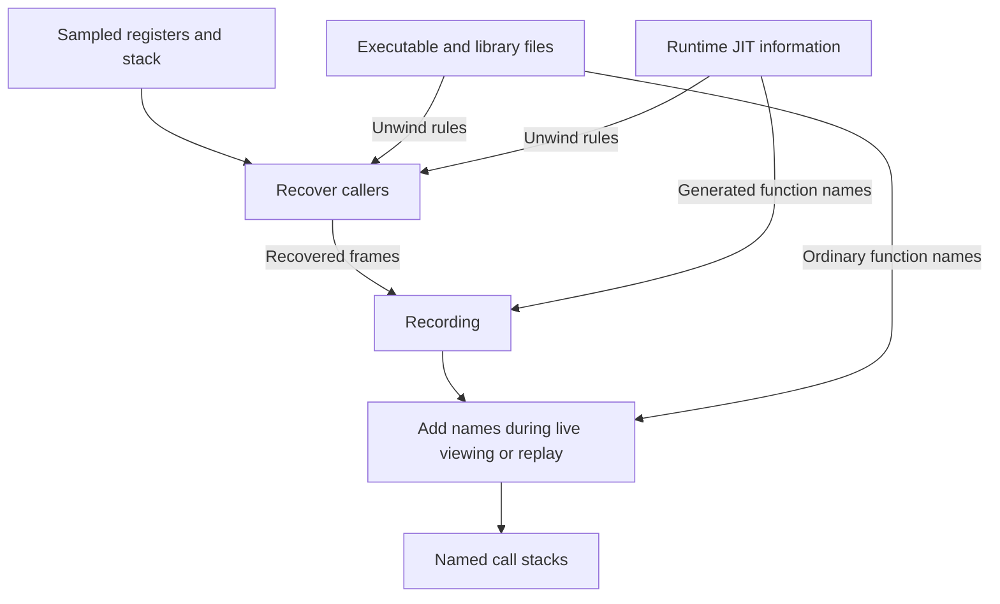
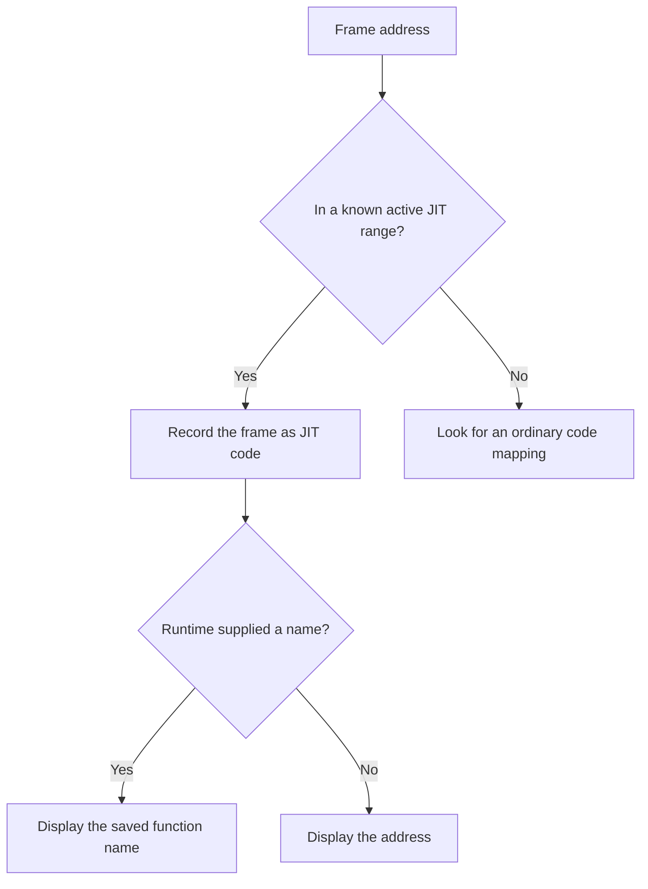
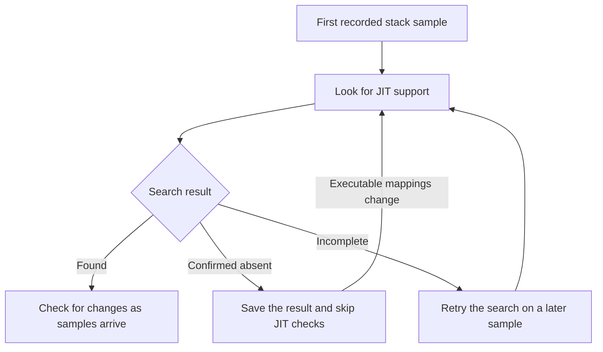
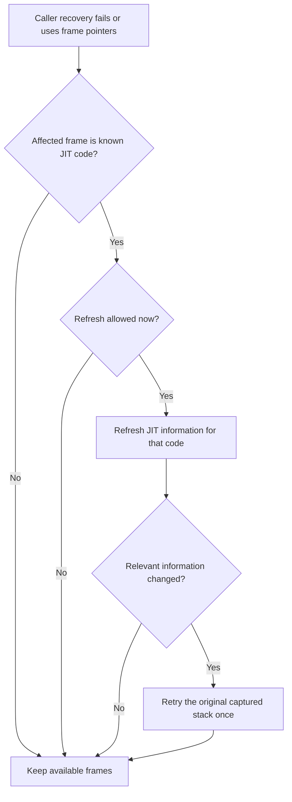

# Recording generated code

A JIT runtime creates machine code while a program runs. StackPulse can save
function names for this generated code. StackPulse can also recover callers when
the runtime supplies unwind rules. These rules describe how to find a caller in
a captured stack.

StackPulse reads this information through the GDB JIT interface. Support
includes LLVM MCJIT on 64-bit little-endian targets. Saved function names remain
available after the process exits.

## Record a JIT workload

1. Check the required runtime settings in the [tested runtimes](#tested-runtimes) table.
2. Give StackPulse permission to read the target process memory through `/proc/<pid>/mem`.
3. Use the usual StackPulse attach or launch operation.

JIT capture needs no additional StackPulse feature flag or symbolizer backend.
StackPulse reads the runtime information without a GDB session. A runtime must
publish this information for StackPulse to use it. The use of LLVM alone does
not guarantee support.

For Numba, enable debug information before compilation:

```sh
NUMBA_DEBUGINFO=1 python program.py
```

A runtime can supply function names without the unwind rules for their callers.
A profile can thus show a generated function name with an incomplete call stack.

## How StackPulse records call stacks

StackPulse uses sampled registers and stack bytes to recover callers. Executable
and library files supply unwind rules for ordinary code. The runtime supplies
unwind rules for generated code. One call stack can contain both kinds of code.

StackPulse saves the recovered frames in the recording. It also saves generated
function names from the runtime. The symbolizer adds names to frames during live
viewing or replay. Ordinary function names can require the original binaries and
debug symbols.



If you enable kernel capture, StackPulse also keeps the captured kernel frames.
Kernel symbols supply their names. Optional perf-map lookup supplies another
source of function names. A perf map does not supply unwind rules.

Hardware CPU cycles drive sampling by default. To select software CPU-clock
sampling, use `Recorder::builder(rate).sampling_event(SamplingEvent::CpuClock)`;
`SamplingEvent` is available in `stackpulse::record`. This provides an alternative
when hardware-interrupt samples produce inconsistent saved user state.

When kernel capture is disabled, StackPulse discards kernel-mode records before
unwinding and reports them in `RecordingSummary::excluded_kernel_samples`. These
records still count toward `sample_events`; they are separate from events lost
by the kernel. Enabling kernel capture permits kernel-mode records and does not
guarantee that their saved user state is consistent.

Linux perf accepts at most 65,528 bytes of requested user stack per sample and
can return fewer bytes. If a generated frame places its caller outside the
captured bytes, increasing the sampling rate cannot recover that caller. Use a
profiler's native-only capture mode with a sufficient stack size for that
workload. Selecting CPU-clock sampling does not change this limit.

GDB JIT capture does not require a perf map or an LLVM jitdump file. It reads
JIT information from the target process during recording.

## How StackPulse identifies generated frames

The runtime publishes the address ranges of its generated code. StackPulse
identifies a frame as JIT code when its address belongs to a known active JIT
range. The recording keeps the connection between that frame and the generated
code.

A missing function name does not identify a JIT frame. An anonymous memory
mapping does not identify a JIT frame either. StackPulse needs the code
information from the runtime.

A known active JIT range remains JIT code even when the runtime supplies no
function names. StackPulse then displays the frame address. It does not replace
that missing name with a binary or perf-map name.



Generated code can occupy part of a named memory mapping. StackPulse uses the
unwind rules for that generated code in its known active JIT range.

Replay uses the recorded connection between a frame and its code. The target
process does not need to exist. Once StackPulse finds replacement code, later
samples can use the new function name. Earlier samples keep their recorded
names. Polling can miss a replacement between checks.

## When StackPulse checks for changes

The first recorded stack sample starts a search for the GDB JIT interface.
Repeated JIT checks start only if StackPulse finds that interface. If a complete
search finds no interface, StackPulse saves that result. Executable mapping
changes allow another search.

An incomplete search does not prove that the interface is absent. StackPulse
retries an incomplete search. After StackPulse finds the interface, checks
continue even when the runtime has no registered code. Checks also continue when
samples contain only ordinary code.



StackPulse checks JIT information when it processes samples. There is no
background polling thread. An idle target receives its next check when a sample
allows it.

| Check | Timing |
| --- | --- |
| Routine checks for registered-code changes | At most once every 100 ms. |
| Full checks of names and unwind rules | Normally once per second. Failed checks can cause earlier retries. |
| Retry of an incomplete discovery search | Once per second. Executable mapping changes can allow an earlier search. |
| Early refresh after a problem in a JIT frame | At most once per process per second. |

These intervals limit check frequency. They do not guarantee a detection time. A
lower sample rate reduces checks only when samples arrive less often than the
applicable interval.

If unwind rules are missing or unusable, StackPulse can try frame pointers to
recover callers. A failure or this fallback can request an early refresh of JIT
information. The affected frame must belong to a known active JIT range. A
missing name or an unknown address cannot request this refresh.



StackPulse retries the captured stack once if the refresh changes the relevant
information. The retry uses the original captured registers and stack bytes.
Only the final attempt contributes stack errors to the recording summary. Read
failures can delay a refresh.

An early refresh updates only the code for the affected frame. It keeps the
information for other frames in that sample. Regular checks process code removal
before the next stack is recovered.

Routine checks continue because code can change without a stack error. If a
check fails, StackPulse can keep older information until a later successful
check. New unwind rules can improve later samples. They cannot add missing
callers to samples that StackPulse already saved.

## Limits and diagnosis

Polling can miss code that the runtime creates and removes between checks.
Samples can use older information before StackPulse finds a change. StackPulse
can also miss rapid address reuse. Polling does not provide a complete history
of runtime changes.

StackPulse accepts up to 4,096 registered objects, with at most 64 MiB of
information per object and 256 MiB in total. If the runtime exceeds a limit,
StackPulse emits a warning and retries once per second. JIT updates pause until
the runtime is within these limits. Previously saved samples keep their names,
but new samples can have missing or outdated JIT information during this pause.

Unwind rules cannot recover stack bytes that the sample did not capture. Large
stack frames can require a larger stack capture. A refresh cannot repair missing
sample data. Some generated functions can have unwind rules while others do not.

Lost events and incomplete stacks are different problems. Lost events mean that
capture missed events. An incomplete stack means that StackPulse could not
recover all callers. Larger capture buffers can help with event loss during
short periods of high activity.

Saved generated names do not require the target process or generated files
during replay. These names do not include source lines or inline frames.
Ordinary frames can still require their original binaries and debug symbols.

Recordings with registered JIT code require an updated StackPulse reader. This
requirement also applies when the runtime supplies no names. Older readers
reject those recordings. Recordings without registered JIT code keep the
existing format.

## Tested runtimes

Local Linux x86-64 tests on 2026-09-19 covered the following versions. Each test
used a compiled workload. Replay ran after process exit, with perf-map lookup
disabled. These results describe the tested settings and workloads.

| Runtime | Required settings in the test | Observed result |
| --- | --- | --- |
| Numba 0.67.0 / llvmlite 0.49.0 | `NUMBA_DEBUGINFO=1` | All 3,998 samples with the tested innermost generated function had three generated frames. All 25 new functions kept their names after exit. |
| Julia 1.13.0 | `ENABLE_GDBLISTENER=1` | All 4,978 samples with the tested innermost generated function had five generated frames. |
| Cling 1.2 | `CLING_DEBUG=1 CLING_JITLINK=0`, `-O2 -g -fno-omit-frame-pointer` | All 7,992 samples with the tested innermost generated function had five generated frames. Names remained correct after code removal and replacement. |
| PostgreSQL 18.6 on Debian | `jit_debugging_support=on` before session startup | All eight generated-code versions kept their names after exit. None of the 3,800 samples had a truncated stack. |
| Impala 4.5.0 | Code generation enabled | None of the 786 samples with generated frames showed a truncated stack. All 12 recorded code versions kept their names after exit. |
| ClickHouse 26.8.7.19 | Compiled expressions enabled | The tested configuration did not publish usable GDB JIT information. StackPulse captured no generated names through this interface. |
| Halide 21.0.0 | Two compiled pipelines | The tested configuration did not publish usable GDB JIT information. StackPulse captured no generated names through this interface. |

Default Numba settings supplied a generated function name but no caller in this
workload. Debug information supplied the missing unwind rules. The setting also
prevented function inlining, so the comparison does not isolate unwind behavior.

Default Julia and Cling settings supplied no JIT information in these tests. The
tested ROOT 6.40.00 Python package also supplied no usable GDB JIT information.
Other builds or settings can produce different results.

PostgreSQL 16.15 on Alpine also preserved all eight generated-code versions.
Some stacks stopped at ordinary native functions. The tests do not identify a
single cause for these incomplete stacks.

Julia created one function shortly before exit that StackPulse did not observe.
Impala, Julia, and Cling also had incomplete stacks outside the tested JIT call
chains. The successful JIT results do not imply complete stacks for every
sample.

Most tests used 499 samples per second and 8 MiB capture buffers per CPU. The
stack capture size was 65,528 bytes. Impala used 199 samples per second and 32
MiB buffers per CPU. An earlier Impala run lost events with 8 MiB buffers. The
larger-buffer run lost none, but required about 1 GiB across 32 CPUs.

## Code removal in other runtimes

A source review on 2026-09-19 examined seven projects. Four release
generated-code memory during use: [PostgreSQL][pg-removal],
[Impala][impala-removal], [ClickHouse][clickhouse-removal], and
[Halide][halide-removal]. [Cling][cling-removal] can remove published JIT
information while it keeps the code in memory. The examined
[Numba][numba-retention] and [Julia][julia-retention] operations keep their
generated code.

Three projects can remove published GDB JIT information during normal
operations: PostgreSQL, Impala, and Cling. PostgreSQL and Cling require
debugging options for this interface. These counts apply to the seven examined
projects. They do not measure how often all LLVM applications remove code.

## Measured cost

A complete search that finds no JIT interface prevents repeated JIT information
reads until executable mappings change. The initial search and checks of the
saved result still have a cost. These tests do not show how much JIT support
increases CPU use for ordinary programs.

After StackPulse finds the interface, it continues these checks even when
samples contain only ordinary frames.

One experiment measured periodic checks with Numba 0.67.0, llvmlite 0.49.0, and
LLVM 22.1.0. It used an AMD Ryzen AI Max+ 395 on Linux x86-64. The target and
recorder ran on separate physical cores.

| Registered code objects | Size of JIT information | Check CPU time per second | Share of one CPU core |
| ---: | ---: | ---: | ---: |
| 15 | 0.137 MiB | 0.82 ms | 0.08% |
| 1,005 | 8.125 MiB | 6.25 ms | 0.62% |

These figures include measurement cost. They exclude stack recovery and sample
recording. The experiment used two four-second measurement periods per mode
after a one-second warmup. The results cover one process and about 8 MiB of JIT
information at most.

Initial JIT discovery and data reads took about 24–38 ms. Application throughput
varied too much to give a reliable slowdown percentage. The large case read
about 8.32 MiB per second at both 1,000 Hz and 100 Hz.

A compilation test lost one event with default capture buffers. A repeat with 8
MiB buffers per CPU lost none. Both recordings saved all 25 new functions. Both
recordings also contained an incomplete stack.

[pg-removal]: https://github.com/postgres/postgres/blob/a477847ebe2a1f700ce1844a8b718fdd66e9b7d0/src/backend/jit/llvm/llvmjit.c#L248-L300
[impala-removal]: https://github.com/apache/impala/blob/6adb9a46a46b98ce6fd474ede39573e2b57c0230/be/src/codegen/llvm-codegen.cc#L523-L535
[clickhouse-removal]: https://github.com/ClickHouse/ClickHouse/blob/ec3c94f00bf7402126df96b6bc68fb94f843cb95/src/Interpreters/ExpressionJIT.cpp#L54-L80
[halide-removal]: https://github.com/halide/Halide/blob/5f95e0c2b5f70738d3b12ce5f43a8bba0a8cf812/src/Pipeline.cpp#L109-L123
[cling-removal]: https://github.com/root-project/cling/blob/1807a1e6f8819029e0931e8c829de794db60f71f/lib/Interpreter/IncrementalJIT.cpp#L765-L779
[numba-retention]: https://github.com/numba/numba/blob/3190b91b3dccd797c3382aaf7988ff8eb3079f79/numba/core/codegen.py#L1402-L1408
[julia-retention]: https://github.com/JuliaLang/julia/blob/d1c37793dd2ab0de6bca636e1d7f2ceb43150a9c/src/jitlayers.cpp#L2169-L2175
